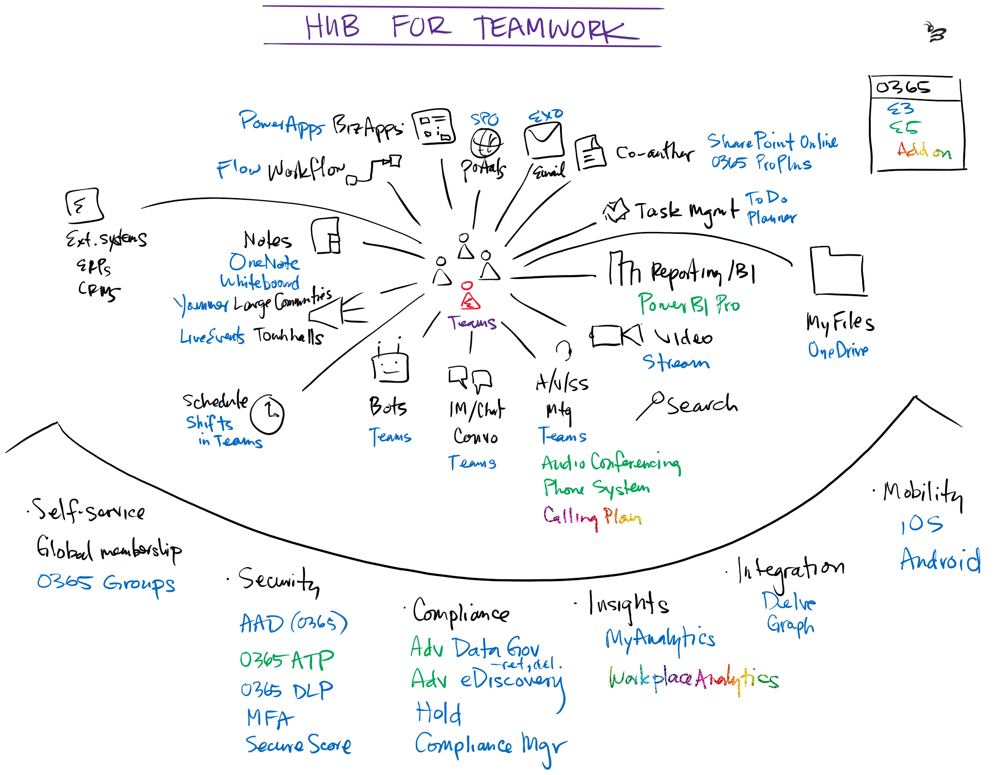

# Plant Technologists
The day's agenda and resources for training, announcements, and roadmap conversations.

## Agenda

## Links
### Instructor-led Learning
- Microsoft Technical Trainings: https://aka.ms/MtcLive
- App in a Day schedule: https://aka.ms/AiadCities
### Guided Learning
- App in a Day lab: https://aka.ms/appinaday
- Dashboard in a Day lab: http://assetsprod.microsoft.com/mpn/en-us/diad.zip
- Office Training Center: https://aka.ms/otc
### New Announcements
- Office Flash Friday: https://aka.ms/OFF
- Ignite 2019 Book of News: https://news.microsoft.com/wp-content/uploads/prod/sites/563/2019/11/Ignite-2019-Book-of-News.pdf
### Governance
- Power Platform Governance and Deployment https://powerapps.microsoft.com/en-us/blog/powerapps-enterprise-deployment-whitepaper/
## Office 365 Overview

